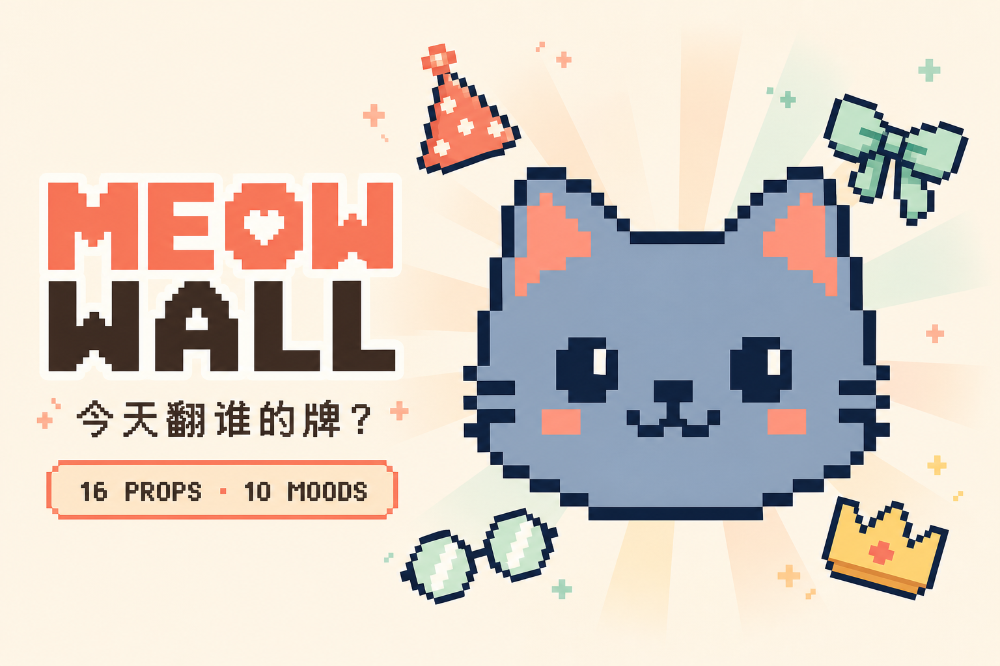

# Meow Wall

[中文说明](#中文说明)

[](https://meow-wall.vercel.app)

A wonderfully useless wall of pixel cat heads, made purely for fun. No accounts, no database, and no external cat-image feed.

Live site: <https://meow-wall.vercel.app>

## What is inside

- **Cat Wall** (`/`): a random featured cat, four special guests, and the full cat archive
- **Studio** (`/studio`): customize colors, combine 16 accessories, choose from 10 expressions, save locally, edit or duplicate your cats, and export SVG
- **Cat Says** (`/says`): give a cat a speech bubble, download a square PNG card, or open the native share sheet
- **Saved Cats** (`/favorites`): browser-local favorites
- **Local backup**: export and import your custom cats as a versioned JSON file
- **Secret Parade**: roll 10 cats to send the four special cats across the screen
- **English / 中文**: English by default, with a persistent language switch

Custom cats and language preferences stay in the browser through `localStorage`.

## Tech stack

Next.js 16 App Router · React 19 · strict TypeScript · Tailwind CSS v4 · shadcn/ui

## Development

```bash
pnpm install
pnpm dev

pnpm lint
pnpm typecheck
pnpm test
pnpm test:e2e:smoke
```

## Deployment

The site deploys automatically from GitHub to Vercel. Pushing the `main` branch triggers a production deployment.

- Repository: <https://github.com/zjl1985/meow-wall>
- Production: <https://meow-wall.vercel.app>
- Environment variables: none
- Database: none

```bash
git push origin main
```

If a local proxy on port `7897` interferes with the Vercel CLI, clear the proxy variables for that command:

```bash
env -u ALL_PROXY -u HTTPS_PROXY -u https_proxy -u HTTP_PROXY -u http_proxy npx vercel ls
```

## License

[MIT](./LICENSE)

---

## 中文说明

一面没什么用、但很快乐的像素猫猫头墙。纯好玩，没有登录、没有数据库，也不会从外网拉猫图。

线上地址：<https://meow-wall.vercel.app>

### 有什么

- **猫墙**（`/`）：随机今日猫猫、四只特别来宾和完整猫猫档案
- **捏猫**（`/studio`）：调色、组合 16 种配饰、切换 10 种表情、保存、编辑或复制猫猫，并导出 SVG
- **猫猫说话**（`/says`）：让猫猫头顶冒泡，下载方形 PNG 分享卡，或打开系统分享面板
- **收藏**（`/favorites`）：保存在浏览器本地
- **本地备份**：将自定义猫猫导出或导入为带版本号的 JSON 文件
- **彩蛋游行**：连续换 10 只猫，四只特别猫会横穿屏幕
- **English / 中文**：默认英文，可随时切换并记住选择

自定义猫猫和语言偏好都只保存在浏览器的 `localStorage` 中。

### 技术栈

Next.js 16 App Router · React 19 · TypeScript strict · Tailwind CSS v4 · shadcn/ui

### 开发

```bash
pnpm install
pnpm dev

pnpm lint
pnpm typecheck
pnpm test
pnpm test:e2e:smoke
```

### 部署

项目通过 GitHub 自动部署到 Vercel。推送 `main` 分支就会触发生产部署。

- 仓库：<https://github.com/zjl1985/meow-wall>
- 生产地址：<https://meow-wall.vercel.app>
- 环境变量：无
- 数据库：无

### 许可证

[MIT](./LICENSE)
